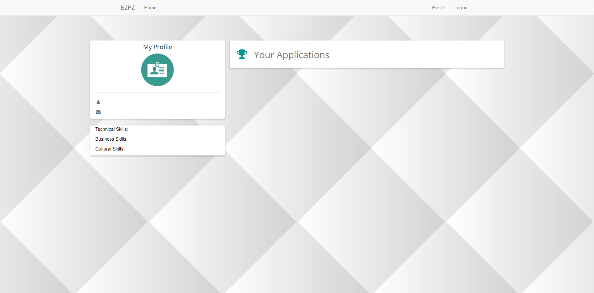

# EZPZ - the way the job search should be!

###### Capstone Group 5
* This project was build with Node.js. To run this you first need to make your own database and link it to /scripts/database.json. Next install all the packages with the command "npm install" and then run the website with the command "node server.js". Finally go into any browser and put localhost:8080 in the url.*